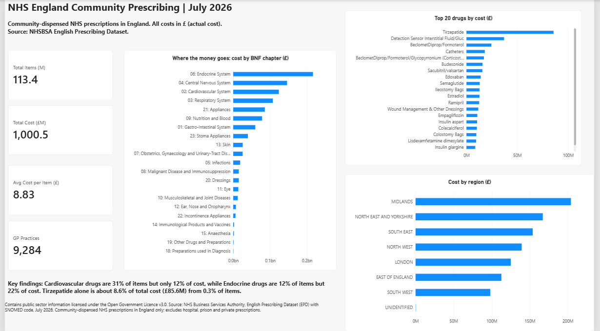
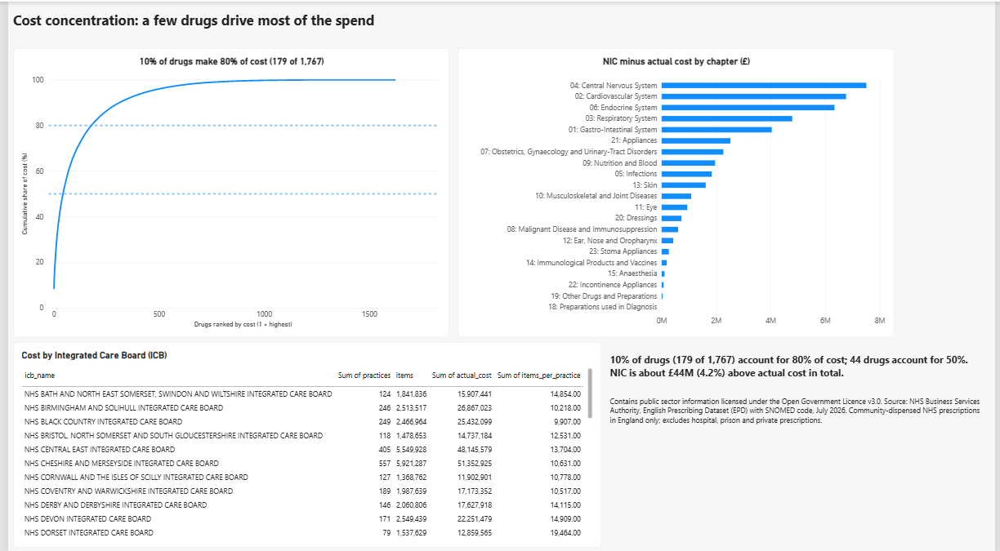

# NHS England Community Prescribing Analysis (July 2026)

> Contains public sector information licensed under the [Open Government Licence v3.0](https://www.nationalarchives.gov.uk/doc/open-government-licence/version/3/).
> Source: NHS Business Services Authority (NHSBSA), English Prescribing Dataset (EPD) with SNOMED code, July 2026.
>
> Attribution statement required by NHSBSA: "NHSBSA Copyright 2025" (as published on the dataset page, accessed 5 October 2026).

**One month of NHS prescribing in England is about 113 million items and £1.0 billion. Where does the money go?**
I loaded 18.6 million rows (a 7.25 GB CSV) into PostgreSQL, built seven aggregated views, and put the results into a two-page Power BI dashboard.




The full dashboard is in [`dashboard/nhs_epd_dashboard.pdf`](dashboard/nhs_epd_dashboard.pdf).

## Key findings

| Finding | Numbers |
|---|---|
| **Items and cost do not move together.** Cardiovascular drugs are the most prescribed but not the most expensive. | Cardiovascular: 35.3M items (31% of all items) but only 12% of cost, at £3.50 per item. Endocrine: 13.4M items (12% of items) but 22% of cost (£216.0M), at £16.09 per item. |
| **A handful of drugs drive the spend.** | 44 of 1,767 drugs (2.5%) account for 50% of cost. 179 drugs (10%) account for 80%. |
| **One drug stands out.** | Tirzepatide: £85.6M (about 8.6% of total cost) from 367,597 items (0.3% of items), at £232.80 per item. |
| **Top chapters by cost** | Endocrine £216.0M, Central Nervous System £145.9M, Cardiovascular £123.6M, Respiratory £107.3M. |
| **Net Ingredient Cost (NIC) is higher than actual cost.** | NIC £1,044.6M versus actual cost £1,000.5M, a gap of £44.1M (4.2%). |

Headline numbers: 113.4M items, £1,000.5M actual cost, £8.83 average cost per item, 9,284 GP practices, 1,767 distinct chemical substances.

## Data

- **Source:** [NHSBSA Open Data Portal, English Prescribing Dataset (EPD) with SNOMED code](https://opendata.nhsbsa.net/dataset/english-prescribing-dataset-epd-with-snomed-code)
- **File used:** `EPD_SNOMED_202607.csv` (July 2026), 27 columns, 18,601,776 rows, about 7.25 GB
- **Licence:** Open Government Licence v3.0 (attribution above)
- **Scope:** NHS prescriptions written in England and dispensed in the community. Hospital, prison and private prescriptions are not included. The data has no patient-identifiable information.
- **Cost columns:** `NIC` is the Net Ingredient Cost (based on the Drug Tariff). `ACTUAL_COST` reflects the national average discount and some dispenser payments. The gap between them is a difference in how cost is measured, not a measured saving.

The raw CSV is **not** in this repository because of its size. See "How to reproduce" below. A 1,000-row random sample is in [`data/epd_sample_1000_rows.csv`](data/epd_sample_1000_rows.csv).

## Data quality

| Check | Result |
|---|---|
| Rows with a missing cost | 0 |
| Rows with a negative cost | 0 |
| Rows with zero items | 0 |
| Rows flagged `UNIDENTIFIED = 'Y'` in the source | 15,017 (about 0.08%), kept as they are |

Numbers in the CSV are stored as quoted text (for example `"24.44"` and `"1."`), so I loaded everything as text first and converted it to proper numbers and dates in a second step.

## Tools

PostgreSQL 18 and pgAdmin 4 (SQL), Power BI Desktop (dashboard and DAX measures), Git and GitHub Desktop.

## Approach

1. **Staging table:** all 27 columns as `TEXT`, loaded with psql `\copy` (much faster than a GUI import for a multi-GB file).
2. **Typed table `epd`:** text converted to dates and numbers; address and PCO columns dropped because the analysis does not use them.
3. **Quality checks:** nulls, negative costs, zero items, unidentified rows.
4. **Seven aggregated views:** KPI totals, BNF chapter, top 20 drugs, Pareto (window functions with a running total), region, ICB, and NIC versus actual cost.
5. **Power BI:** only the seven small views are imported (not the 18.6M-row table), so the report stays light. The KPI cards use DAX measures.

SQL techniques used: `GROUP BY` aggregation, `COUNT(DISTINCT)`, `FILTER`, window functions (`SUM() OVER`, `ROW_NUMBER`), CTEs and views.

## How to reproduce

1. Download the EPD with SNOMED code CSV for July 2026 from the NHSBSA Open Data Portal (link above) and unzip it to `C:\Data\`.
2. Create a database: `CREATE DATABASE nhs_prescribing;`
3. Run the staging table from [`sql/nhs_epd_analysis.sql`](sql/nhs_epd_analysis.sql), then run the `\copy` command from the file in **psql (SQL Shell)**.
4. Run the rest of the file: typed table, checks and views.
5. Open Power BI, connect to PostgreSQL (`localhost:5432`, database `nhs_prescribing`), and import the seven `vw_*` views.

## Repository structure

```
nhs-prescribing-analysis/
├── README.md
├── sql/nhs_epd_analysis.sql
├── dashboard/nhs_epd_dashboard.pdf
├── data/epd_sample_1000_rows.csv
├── images/overview.png
├── images/concentration.png
└── .gitignore
```

## Limitations

- One month only (July 2026), so there are no trends over time.
- The analysis describes what was prescribed and what it cost. It says nothing about why, or about patient outcomes.
- Costs are NHS prices in pounds (£), not retail prices.
- Rows flagged `UNIDENTIFIED` are included in all totals.
